# Setting up Home Assistant on a Raspberry Pi 3/4

The easiest way I have seen to do this is to download and install Raspberry Pi Imager (https://www.raspberrypi.com/software/).

## To install Raspberry Pi Imager on Ubuntu, do the following

1. Download the Ubuntu installer from https://www.raspberrypi.com/software
2. Open terminal
3. ```sudo apt install .\imager_%version%_amd64.db``` (change ```%version%``` to the correct version)

## To install Home Assistant on a Raspberry Pi 3 or 4

Note: I am doing this from Ubuntu, but would be similar from Windows and MacOS.

1. Insert microSD card into computer
   1. I read it is recommended to use at least a 64GB microSD card.  However, for this demonstration I am using a 16GB as it should have plenty of space for what we are doing during this presentation.
2. Open Raspberry Pi Imager  
    - 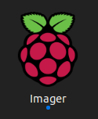  
3. Click the "CHOOSE OS" button  
    - 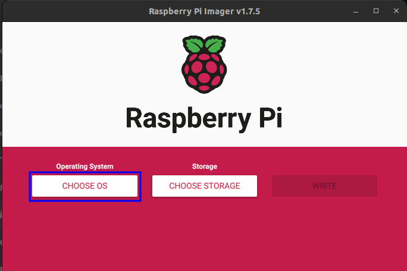  
4. Choose "Other specific-purpose OS" (likely requires scrolling down)  
    - 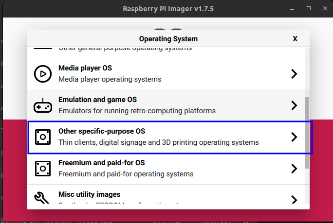
5. Choose "Home assistant and home automation"  
    - 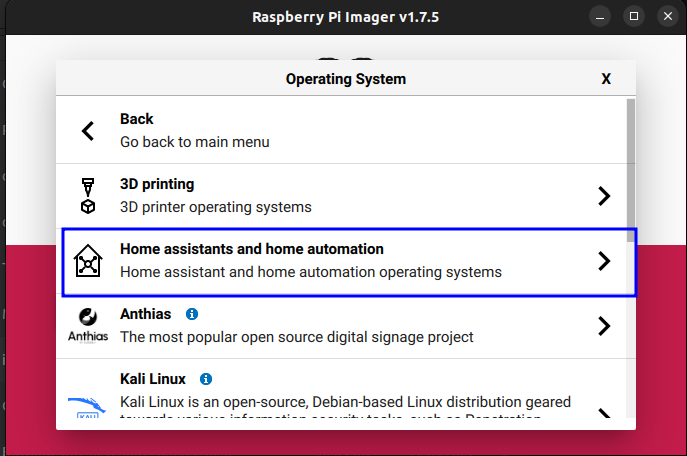  
6. Choose "Home Assistant" (likely requires scrolling down)  
    - 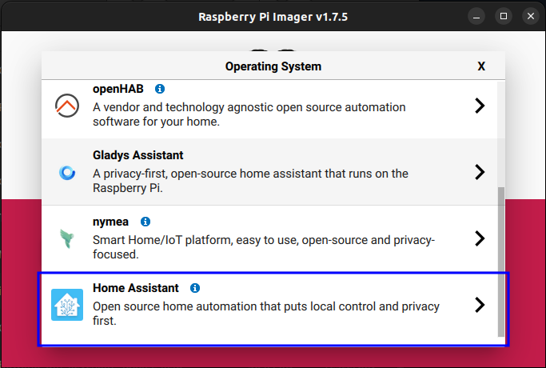  
7. Choose the appropriate option for your model of RPi  
    - 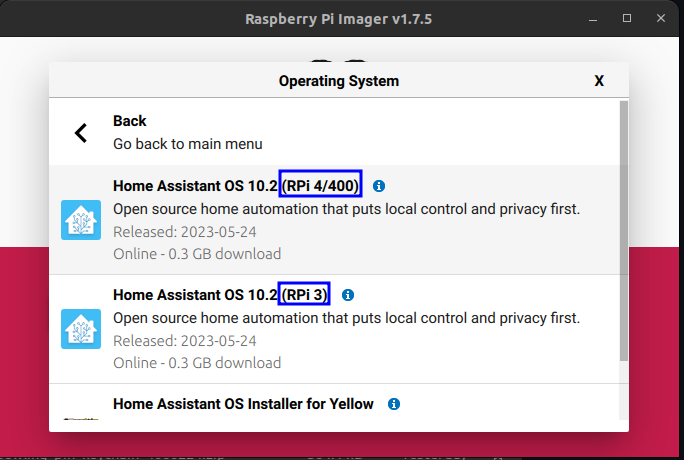  
8. Click the "CHOOSE STOR..." button  
    -   
9. Choose the appropriate device to install to  
    - 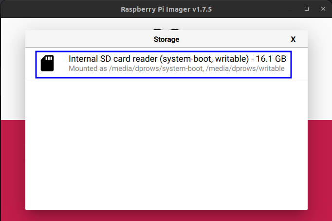  
10. Click the "WRITE" button  
    - 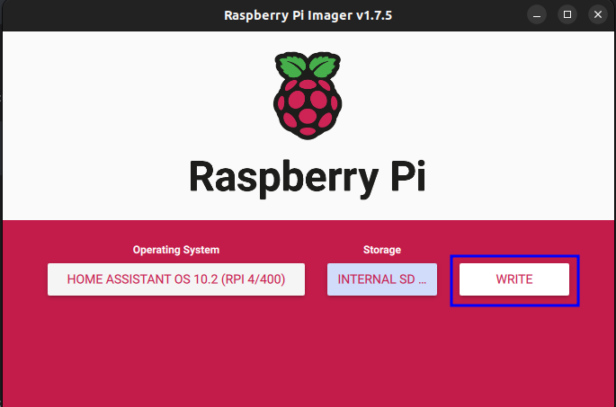  
11. Click the "YES" button to agree to continue and overwrite existing data on the card
    -   
12. You may be required to enter credentials to continue
13. The program will go through a series of step (Downloading, Writing, and Verifying)  
    - 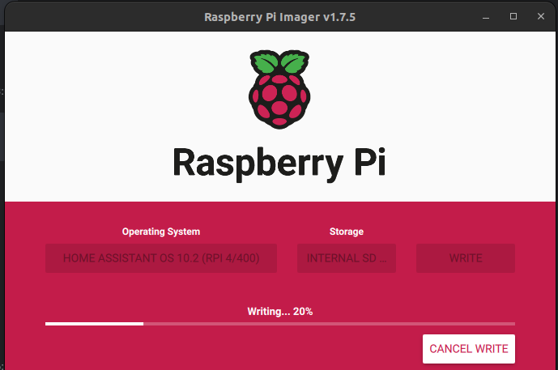  
14. Removed the microSD card from your computer and click "CONTINUE"  
    - 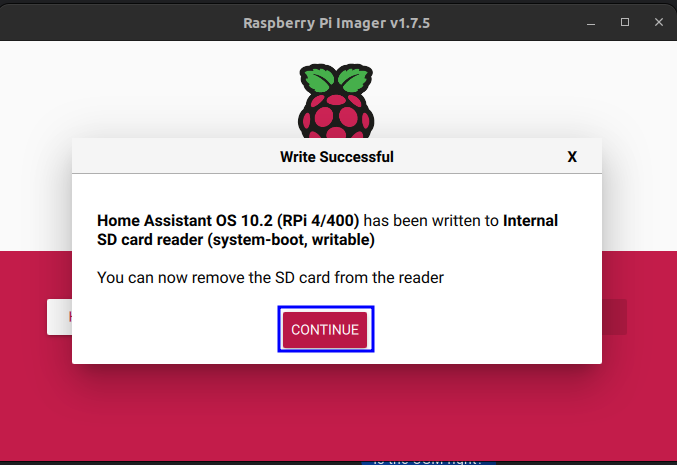  
15. Close out of Raspberry Pi Imager as we are done with it

## Initial Configuration Home Assistant

Note: This assumes you have inserted the microSD card into the RPi and connected power, display, and network cable.  Yes, as far as I know, it requires a physical connection to the network to do the initial configuration.  The display isn't required if you aquire the devices IP address from your DHCP server.

1. Power on the Raspberry Pi, if not already powered on, and wait for the CLI to be ready and display an IP address.
2. Open a browser on your computer and go to the IP address listed on the RPi using port 8123.
    - Example: http://192.168.1.250:8123
3. You should see a screen similar to the one below
    - 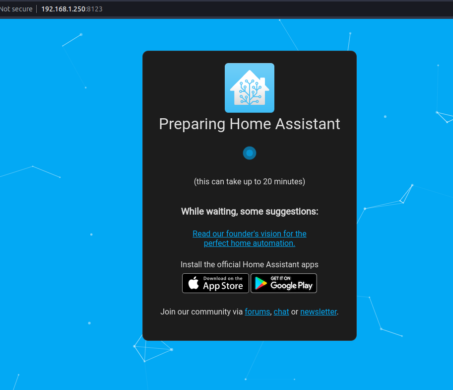  
    - If you want to see the logs as it is starting up, then click the blue animated dot
4. When it is ready enter Name, Username, and Password (twice) and click Create Account  
    - 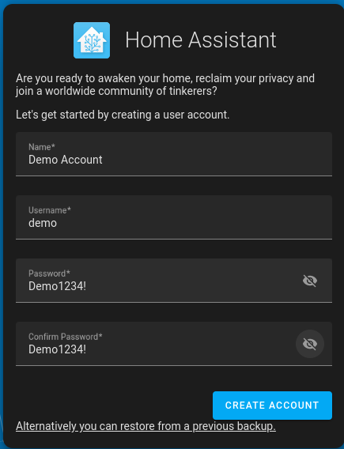  
5. Enter a name for this HA install and either click DETECT or enter Country and Language
    - I would also do the Time Zone, Unit System, and Currency if it didn't populate correctly  
    - 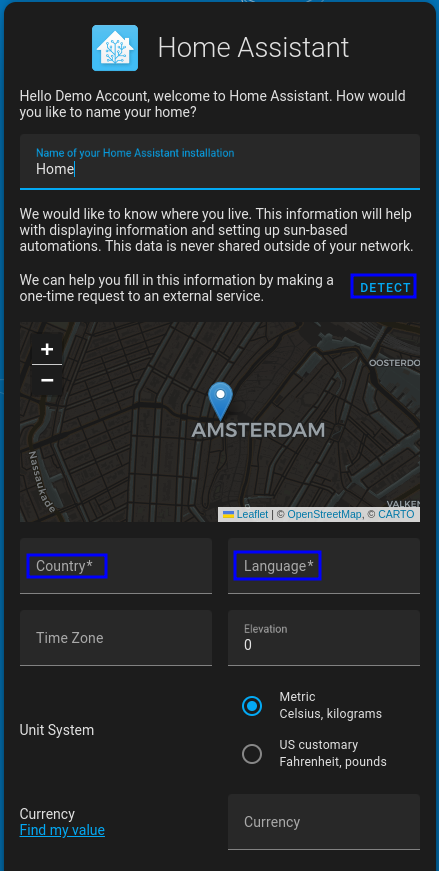  
6. Click Next
7. Select what anonymized data you want to send to HA and click NEXT  
    - 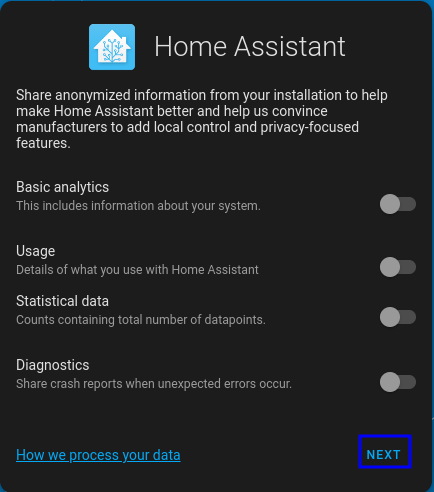  
8. You will get a screen showing Devices and Services HA discovered on your network which can be integrated
9. Either set them up by clicking on the ones you want or click FINISH
